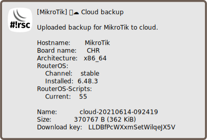

Upload backup to Mikrotik cloud
===============================

[◀ Go back to main README](../README.md)

> ℹ️ **Info**: This script can not be used on its own but requires the base
> installation. See [main README](../README.md) for details.

Description
-----------

This script uploads
[binary backup to Mikrotik cloud](https://wiki.mikrotik.com/wiki/Manual:IP/Cloud#Backup).

> ⚠️ **Warning**: The used command can hit errors that a script can not handle.
> This may result in script termination (where no notification is sent) or
> malfunction of fetch command (where all up- and downloads break) for some
> time. Failed notifications are queued then.

### Sample notification

Requirements and installation
-----------------------------

Just install the script:

    $ScriptInstallUpdate backup-cloud;

Configuration
-------------

The configuration goes to `global-config-overlay`, these are the parameters:

* `BackupPassword`: password to encrypt the backup with
* `BackupRandomDelay`: delay up to amount of seconds when run from scheduler

Also notification settings are required for e-mail,
[matrix](mod/notification-matrix.md) and/or
[telegram](mod/notification-telegram.md).

Usage and invocation
--------------------

Just run the script:

    / system script run backup-cloud;

Creating a scheduler may be an option:

    / system scheduler add interval=1w name=backup-cloud on-event="/ system script run backup-cloud;" start-time=09:20:00;

See also
--------

* [Send backup via e-mail](backup-email.md)
* [Save configuration to fallback partition](doc/backup-partition.md)
* [Upload backup to server](backup-upload.md)

---
[◀ Go back to main README](../README.md)  
[▲ Go back to top](#top)
