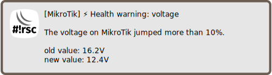

Notify about health state
=========================

[◀ Go back to main README](../README.md)

> ℹ️ **Info**: This script can not be used on its own but requires the base
> installation. See [main README](../README.md) for details.

Description
-----------

This script is run from scheduler periodically, sending notification on
health related events:

* voltage jumps up or down more than configured threshold or drops below limit
* power supply failed or recovered
* temperature is above or below threshold

Note that bad initial state will not trigger an event.

Only sensors available in hardware can be checked. See what your
hardware supports:

    / system health print;

### Sample notifications

#### Voltage

#### Temperature

  

#### PSU state

  

Requirements and installation
-----------------------------

Just install the script and create a scheduler:

    $ScriptInstallUpdate check-health;
    / system scheduler add interval=1m name=check-health on-event="/ system script run check-health;" start-time=startup;

Configuration
-------------

The configuration goes to `global-config-overlay`, these are the parameters:

* `CheckHealthTemperature`: an array specifying temperature thresholds for sensors
* `CheckHealthVoltageLow`: value (in volt*10) giving a hard lower limit
* `CheckHealthVoltagePercent`: percentage value to trigger voltage jumps

Also notification settings are required for e-mail, matrix and/or
[telegram](mod/notification-telegram.md).

---
[◀ Go back to main README](../README.md)  
[▲ Go back to top](#top)
