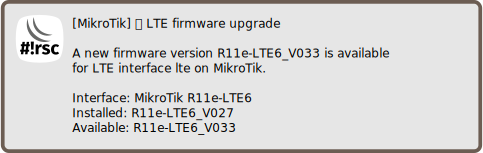

Notify on LTE firmware upgrade
==============================

[◀ Go back to main README](../README.md)

> ℹ️ **Info**: This script can not be used on its own but requires the base
> installation. See [main README](../README.md) for details.

Description
-----------

This script is run from scheduler periodically, checking for LTE firmware
upgrades. Currently supported LTE hardware:

* R11e-LTE
* R11e-LTE-US
* R11e-4G
* R11e-LTE6

### Sample notification

Requirements and installation
-----------------------------

Just install the script:

    $ScriptInstallUpdate check-lte-firmware-upgrade;

... and create a scheduler:

    /system/scheduler/add interval=1d name=check-lte-firmware-upgrade on-event="/system/script/run check-lte-firmware-upgrade;" start-time=startup;

Configuration
-------------

Notification setting are required for e-mail,
[matrix](mod/notification-matrix.md) and/or
[telegram](mod/notification-telegram.md).

See also
--------

* [Notify on RouterOS update](check-routeros-update.md)
* [Install LTE firmware upgrade](unattended-lte-firmware-upgrade.md)

---
[◀ Go back to main README](../README.md)  
[▲ Go back to top](#top)
