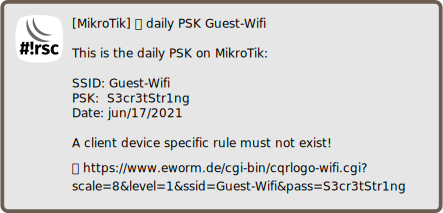

Use wireless network with daily psk
===================================

[◀ Go back to main README](../README.md)

> 🛈 **Info**: This script can not be used on its own but requires the base
> installation. See [main README](../README.md) for details.

Description
-----------

This script is supposed to provide a wifi network which changes the
passphrase to a pseudo-random string daily.

### Sample notification

Requirements and installation
-----------------------------

Just install this script.

Depending on whether you use CAPsMAN (`/ caps-man`) or local wireless
interface (`/ interface wireless`) you need to install a different script.

For CAPsMAN:

    $ScriptInstallUpdate daily-psk.capsman;

For local interface:

    $ScriptInstallUpdate daily-psk.local;

And add schedulers to run the script:

    / system scheduler add interval=1d name=daily-psk-nightly on-event="/ system script run daily-psk.local;" start-date=may/23/2018 start-time=03:00:00;
    / system scheduler add name=daily-psk-startup on-event="/ system script run daily-psk.local;" start-time=startup;

These will update the passphrase on boot and nightly at 3:00.

Configuration
-------------

The configuration goes to `global-config-overlay`, these are the parameters:

* `DailyPskMatchComment`: pattern to match the wireless access list comment
* `DailyPskSecrets`: an array with pseudo random strings

Then add an access list entry:

    / interface wireless access-list add comment="Daily PSK" interface=wl-daily private-pre-shared-key="ToBeChangedDaily";

Also notification settings are required for e-mail, matrix and/or telegram.

---
[◀ Go back to main README](../README.md)  
[▲ Go back to top](#top)
