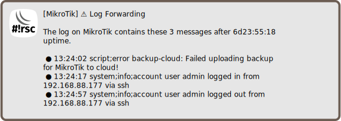

Forward log messages via notification
=====================================

[◀ Go back to main README](../README.md)

> ℹ️ **Info**: This script can not be used on its own but requires the base
> installation. See [main README](../README.md) for details.

Description
-----------

RouterOS supports sending log messages via e-mail or to a syslog server.
This has some limitation, however:

* does not work early after boot if network connectivity is not
  yet established
* lots of messages generate a flood of mails
* Matrix and Telegram are not supported

The script is intended to be run periodically. It collects log messages
and forwards them via notification.

### Sample notification

Requirements and installation
-----------------------------

Just install the script:

    $ScriptInstallUpdate log-forward;

... and add a scheduler:

    / system scheduler add interval=1m name=log-forward on-event="/ system script run log-forward;" start-time=startup;

Configuration
-------------

The configuration goes to `global-config-overlay`, these are the parameters:

* `LogForwardFilter`: define topics *not* to be forwarded
* `LogForwardFilterMessage`: define message text *not* to be forwarded
* `LogForwardInclude`: define topics to be forwarded (even if filter matches)
* `LogForwardIncludeMessage`: define message text to be forwarded (even if
  filter matches)

Also notification settings are required for e-mail,
[matrix](mod/notification-matrix.md) and/or
[telegram](mod/notification-telegram.md).

---
[◀ Go back to main README](../README.md)  
[▲ Go back to top](#top)
