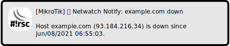
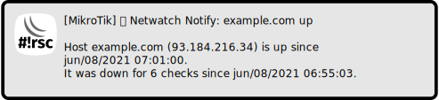

Notify on host up and down
==========================

[◀ Go back to main README](../README.md)

🛈 This script can not be used on its own but requires the base installation.
See [main README](../README.md) for details.

Description
-----------

This script sends notifications about host UP and DOWN events. In comparison
to just netwatch (`/ tool netwatch`) and its `up-script` and `down-script`
this script implements a simple state machine and dependency model. Host
down events are triggered only if the host is down for several checks and
optional parent host is not down to avoid false alerts.

### Sample notifications

  

Requirements and installation
-----------------------------

Just install the script:

    $ScriptInstallUpdate netwatch-notify;

Then add a scheduler to run it periodically:

    / system scheduler add interval=1m name=netwatch-notify on-event="/ system script run netwatch-notify;" start-time=startup;

Configuration
-------------

The hosts to be checked have to be added to netwatch with specific comment:

    / tool netwatch add comment="notify, hostname=example.com" host=[ :resolve "example.com" ];

It is possible to run an up hook command (`up-hook`) or down hook command
(`down-hook`) when a notification is triggered. This has to be added in
comment:

    / tool netwatch add comment="notify, hostname=poe-device, down-hook=/ interface ethernet poe power-cycle en21;" host=10.0.0.20;

Also there is a `pre-down-hook` that fires at two thirds of failed checks
required for the notification. The idea is to fix the issue before a
notification is sent.

The count threshould (default is 5 checks) is configurable as well:

    / tool netwatch add comment="notify, hostname=example.com, count=10" host=104.18.144.11;

If the host is behind another checked host add a dependency, this will
suppress notification if the parent host is down:

    / tool netwatch add comment="notify, hostname=gateway" host=93.184.216.1;
    / tool netwatch add comment="notify, hostname=example.com, parent=gateway" host=93.184.216.34;

Note that every configured parent in a chain increases the check count
threshould by one.

The host address can be updated dynamically. Give extra parameter `resolve`
with a resolvable name:

    / tool netwatch add comment="notify, hostname=example.com, resolve=example.com";

But be warned: Dynamic updates will probably cause issues if the name has
more than one record in dns - a high rate of configuration changes (and flash
writes) at least.

Also notification settings are required for e-mail, matrix and/or telegram.

Tips & Tricks
-------------

### One of several hosts

Sometimes it is sufficient if one of a number of hosts is available. You can
make `netwatch-notify` check for that by adding several items with same
`hostname`. Note that `count` has to be multiplied to keep the actual time.

    / tool netwatch add comment="notify, hostname=service, count=10" host=10.0.0.10;
    / tool netwatch add comment="notify, hostname=service, count=10" host=10.0.0.20;

### Checking internet connectivity

Sometimes you can not check your gateway for internet connectivity, for
example when it does not respond to pings or has a dynamic address. You could
check `1.1.1.1` (Cloudflare DNS), `9.9.9.9` (Quad-nine DNS), `8.8.8.8`
(Google DNS) or any other reliable address that indicates internet
connectivity.

    / tool netwatch add comment="notify, hostname=internet" host=1.1.1.1;

A target like this suits well to be parent for other checks.

    / tool netwatch add comment="notify, hostname=example.com, parent=internet" host=93.184.216.34;

### Checking specific ISP

Having several ISPs for redundancy a failed link may go unnoticed without
proper monitoring. You can use routing-mark to monitor specific connections.
Create a route and firewall mangle rule.

    / ip route add distance=1 gateway=isp1 routing-mark=via-isp1;
    / ip firewall mangle add action=mark-routing chain=output new-routing-mark=via-isp1 dst-address=1.0.0.1 passthrough=yes;

Finally monitor the address with `netwatch-notify`.

    / tool netwatch add comment="notify, hostname=quad-one via isp1" host=1.0.0.1;

Note that *all* traffic to the given address is routed that way. In case of
link failure this address is not available, so use something reliable but
non-essential. In this example the address `1.0.0.1` is used, the same service
(Cloudflare DNS) is available at `1.1.1.1`.
---
[◀ Go back to main README](../README.md)  
[▲ Go back to top](#top)
