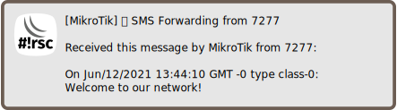

Forward received SMS
====================

[◀ Go back to main README](../README.md)

> 🛈 **Info**: This script can not be used on its own but requires the base
> installation. See [main README](../README.md) for details.

Description
-----------

RouterOS can receive SMS. This script forwards SMS as notification.

A broadband interface with SMS support is required.

### Sample notification

Requirements and installation
-----------------------------

Just install the script:

    $ScriptInstallUpdate sms-forward;

... and add a scheduler to run it periodically:

    / system scheduler add interval=2m name=sms-forward on-event="/ system script run sms-forward;" start-time=startup;

Configuration
-------------

Notification settings are required for e-mail, matrix and/or telegram. Also
you have to enable receiving of SMS:

    / tool sms set receive-enabled=yes;

See also
--------

* [Act on received SMS](sms-action.md)

---
[◀ Go back to main README](../README.md)  
[▲ Go back to top](#top)
